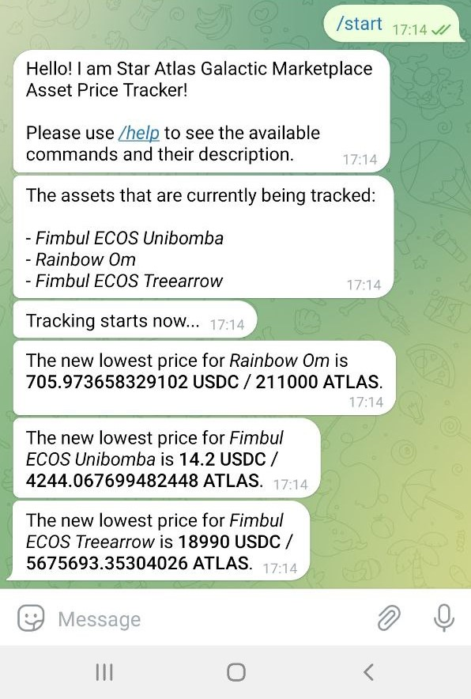
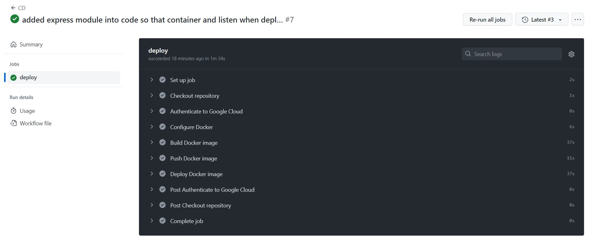
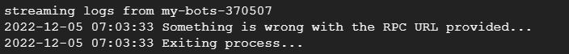
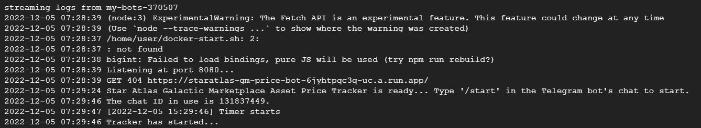

# **Star Atlas Galactic Marketplace Price Tracker**

### **Description**
[Star Atlas](https://staratlas.com/) is a massive multiplayer online grand strategy game of space exploration, territorial conquest, and political domination that takes place in a virtual gaming metaverse.

Star Atlas Galactic Marketplace Asset Price Tracker is a bot that notify users the lowest selling price of an asset in the [Star Atlas Galactic Marketplace](https://play.staratlas.com/market) through Telegram.
<br>

### **Installation**
1. Clone the repository using
    ```
    git clone https://github.com/gordonjun2/StarAtlas-GM-Price-Bot.git
    ```
2. Get a Solana *RPC URL* from your preferred node.
    - Eg. https://syndica.io/ (free option)
    - Copy the *RPC URL* into the *private.json* file, under the key *"rpcURL"*.
        - For Syndica, the *RPC URL* will be in this format: `"https://solana-api.syndica.io/access-token/<your access token>/rpc"`, where `<your access token>` is to be edited.
    - You can also have multiple *RPC URLs* and place them in an array. This will be useful if you have limited RPC usage per *RPC URL*. In addition, any *RPC URL* that has reached the maximum request limit will be automatically removed from the array as the bot runs.
        - The format for multiple *RPC URL*: `["https://solana-api.syndica.io/access-token/<your access token 1>/rpc", "https://solana-api.syndica.io/access-token/<your access token 2>/rpc", ...]`
3. Get a *CoinMarketCap API* by signing up at https://coinmarketcap.com/api/.
    - Copy the *CoinMarketCap API* into the *private.json* file, under the key *"cmcAPIKey"*.
4. Create a Telegram Bot using BotFather and save the *HTTP API* key (refer to the guide [here](https://medium.com/shibinco/create-a-telegram-bot-using-botfather-and-get-the-api-token-900ba00e0f39)).
    - You can choose any name and username for the bot.
    - Copy the *HTTP API* key into the *private.json* file, under the key *"teleAPIKey"*.
5. Change directory into `./StarAtlas-GM-Price-Bot` and run
    ```
    npm i
    ```
6. Done!
<br>

### **Usage**
1. Run the command below to start the bot:
    ```
    node main.js -f private.json
    ```
2. Once the bot is ready, look for the Telegram Bot you created in Telegram by searching for its Telegram username (eg. `@<bot's username>`).
3. Click on `/start` to start the tracking.
    <br>
    
    
4. Done! You can leave the bot running in your terminal.
    - To stop the bot, just do a `Ctrl+C`.
    - To keep the bot running without the need to have your computer switched on all the time, consider deploying the repository into a Cloud service (see **Deploy to Cloud** section below).
<br>

### **Usage Tips**
- In the Telegram chat with the bot, type `/help` to get all available commands to use.
    - Currently implemented:
        - `/start`: Re-initialise tracking and list assets being tracked (do not need to use again)
        - `/list`: List assets being tracked
        - `/modify`: Modify assets to be tracked
            - Some assets are already added. You can remove them and add new assets here.
        - `/help`: To list the available commands and their description
- You can set the data retrieving interval in `main.js` under 
    ```
    function begin_bot(){
    teleBot.telegram.sendMessage(chatID, "Tracking starts now...", { parse_mode: 'HTML' });
    console.log(getDateTime() + ' Timer starts');
    scanManager = setInterval(scan, 30 * 1000);                             // check every 30 sec
    checkAliveManager = setInterval(checkAlive, 6 * 60 * 60 * 1000);        // check every 6 hours
    scan();
    }
    ```
    - Change the interval value to your own preference.
    - Please see **Note** section below.
<br>

### **Deploy to Cloud**
- In this repository, only [Google Cloud Platform (GCP)](https://cloud.google.com/) is being used here. There are a few ways to go about deploying the program to GCP. I experimented with two ways. When testing **Method 1** with GitHub Actions, I intentionally left the private keys in *private.json* blank. This is to prevent me from commiting my keys into this public repository. For **Method 2**, my keys can remain in *private.json* since I do not need to commit them to GitHub (there is an option to use GitHub Actions too).
- Before following the steps below, please fork this repository first.
- **Method 1 using GitHub Actions and Workload Identity Federation** (follow the guide [here](https://blog.leandrotoledo.org/deploying-google-cloud-run-using-github-actions-and-workload-identity-authentication/))
    1. Change directory into `./StarAtlas-GM-Price-Bot` and run
        ```
        docker build . --no-cache -t staratlas-gm-price-bot
        ```
    2. Continue with the steps using the link above, starting from the ***Create a Google Cloud Project*** header.
        - Use Cloud Shell in the browser to run the commands.
    3. Follow ***Create a Google Cloud Project***.
    4. Follow ***Create a Workload Identity on Google Cloud***.
    5. Follow ***Create a GitHub Actions Workflow***.
    6. When deploying Cloud Run for the first time, an authentication error will be shown in the GitHub Actions' Workflow (To see, click on the `Actions` tab in your forked repository. Then, click into the latest workflow run and then `deploy` under `Jobs`.). To fix this error, the Cloud Run service should set to allow unauthenticated access. Run the below command in the Cloud Shell:
        ```
        gcloud run services add-iam-policy-binding app \
                    --member="allUsers" \
                    --role="roles/run.invoker"
        ``` 
    7. Run the below command in the Cloud Shell to start streaming logs before the deployment is being done again (refer [here](https://cloud.google.com/run/docs/logging)):
        ```
            gcloud alpha run services logs tail app --project PROJECT-ID
        ```
        - Edit `PROJECT-ID` based on your own project ID (see the steps in the link above).
    8. Return back to the page where the GitHub Actions' workflow run is shown (refer to Step 3.) and click on `Re-run all the jobs`.
    9. The deployment should be successful (see image below), and you can view the logs in the Cloud Shell (refer to Step 4.).
    
    10. Since the private keys are not in *private.json*, the program will exit (see the image below). However, this shows that the program is being deployed correctly.
    
    <br>

- **Method 2 using Google Cloud Artifact Registry** (follow the guide [here](https://deno.land/manual@v1.28.1/advanced/deploying_deno/google_cloud_run))
    1. Change directory into `./StarAtlas-GM-Price-Bot` and run
        ```
        docker build . --no-cache -t staratlas-gm-price-bot
        ```
    2. Continue with the steps using the link above, starting from the ***Set up Artifact Registry*** header.
        - Use Cloud Shell in the browser to run the commands.
        - Since the docker is built in Step 1., skip if required to.
    3. Follow ***Set up Artifact Registry***.
        - You can give a different Artifact Registry name.
    4. Follow ***Build, Tag, and Push to Artifact Registry***.
        - Since the docker is built in Step 1., do not use the build command.
        - You can give a different Artifact Registry image name 
        - Tag the local docker image name (`staratlas-gm-price-bot`) with the Artifact Registry address, repository, and name.
    5. Follow ***Create a Google Cloud Run Service***.
        - Make sure to use the correct port number when setting up the Google Cloud Run Service.
        - In this repository, port 8080 is used (see `main.js` and `Dockerfile`).
    6. Run the below command in the Cloud Shell to start streaming logs before the deployment is being done again (refer [here](https://cloud.google.com/run/docs/logging)):
        ```
            gcloud alpha run services logs tail app --project PROJECT-ID
        ```
        - Edit `PROJECT-ID` based on your own project ID (see the steps in the link above).
    7. Follow ***Deploy with gcloud***.
        - Since the private keys are in *private.json*, the program will run (see the image below). It shows that the program is being deployed correctly.
        
    8. You can follow ***Automate Deployment with GitHub Actions***, but remember not to commit your keys to your public repository.
 <br>

### **Note**
- The program uses the [`@staratlas/factory`](https://www.npmjs.com/package/@staratlas/factory) package.
    - [Package documentations](https://staratlasmeta.github.io/factory/modules.html)
- The bot does not make use of the class `GmEventService` in the package `@staratlas/factory`. Thus, it does not react immediately to new events happening in the marketplace (eg. new sell orders). Rather, it uses the `GmClientService` based on a fixed interval set in `main.js`.
    - My intention was to use `GmEventService` as this can probably reduce the frequency of RPC calls, but I am unsure on how to use it. Please hit me up if you know how to do it.
- I am very new to JavaScript. Please let me know if there are any errors or ways the code may be improved.
- I am also new to DevOps / Cloud Engineering. Please let me know if there are any better way to go about the deployment of the program.

